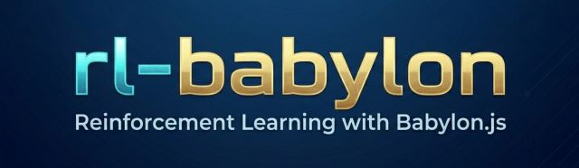

# RL-Babylon-Environments

**BabylonEnv** handles communication between a Reinforcement Learning (RL) agent and a Babylon.js environment. It supports both **numerical states** and **visual observations (pixel frames)**, allowing seamless integration with RL algorithms.

## Features

- Full WebSocket communication with Babylon.js  
- Support for visual observations (pixel frames)  
- Gym-like interface: `init()`, `reset()`, `step(action)`  
- Easy integration into RL pipelines  
- Offers 7 Babylon.js environments - ready for training with RL algorithms like PPO or SAC

## Get started

Simply clone the repository, start a local server (for example using Live Server in VS Code), open your browser (recommended: Chrome), and navigate to the Environment.html file inside the desired environment folder.

Or simply run `python -m http.server 5500` in the RL-Babylon-Environments folder

Go to [RL-BABYLON](../readme.md) where you can find the python trainers and follow instructions to start training. It has code for PPO and SAC trainers. You can train the environments of this repository.

Study the environments to see how you can build an environment on your own. You must add a scene (setupScene) with the agent and the world it interacts with. Then you have to code the resteEnv and stepEnv methods.

## Example Environments

- Cube-Ball (Vector-Obs)
- Cube-Ball (Visual-Obs)
- Cube-Ball (Continous-SAC-Demo)
- Cube-Ball (Blender-Demo)
- Cart-Pole (Vector-Obs)
- Balancing-Ball (Vector-Obs)
- Lunar-Lander

## ToDo

- More environments
- Generate docs

