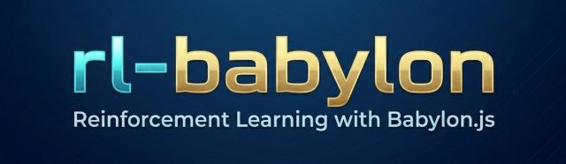

# RL-Babylon - Reinforcement Learning with Babylon.js

**RL-Babylon** is a Python framework that enables Reinforcement Learning (RL) agents to interact with **Babylon.js environments** via WebSockets. It provides a flexible, asynchronous interface for training RL algorithms in visually rich 3D environments rendered directly in the browser. With RL-Babylon, you can easily integrate **state-based** or **pixel-based observations** into your RL workflow.

## Features

- **WebSocket-based Environment** – Real-time communication with Babylon.js scenes  
- **Visual & Numeric Observations** – Supports raw pixel frames or structured state vectors  
- **Gym-like Interface** – Easy `init()`, `reset()`, and `step()` API  

## Getting started

- [Getting Started](.docs/GETTING_STARTED.md) — setup, launch commands, configuration, and known limitations.

## Trainers

- [PPO](./rl-trainers/ppo/ppo.md)
- [SAC](./rl-trainers/sac/sac.md)

## Environments

The Babylon.js environments and their shared browser libraries are in [.environments](./.environments/README.md). Serve that directory locally, then connect a PPO or SAC trainer over WebSockets. See the [Getting Started guide](.docs/GETTING_STARTED.md) for exact commands and current compatibility notes.

Environment pages currently included:

 - Cube-Ball (vector and visual observations)
 - Cube-Ball continuous-control demo (SAC)
 - Cart Pole
 - Balancing Ball
 - Lunar Lander
